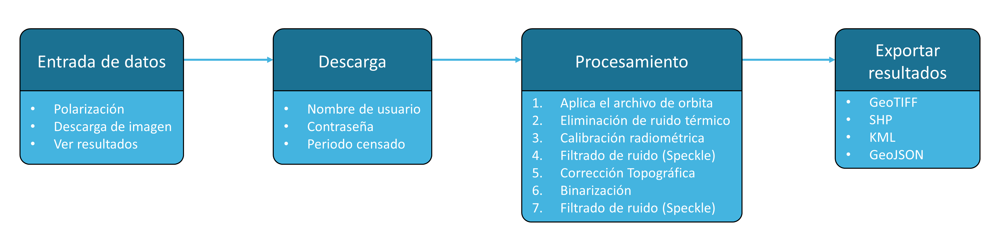

[English](https://github.com/UN-SPIDER/radar-based-flood-mapping) | Español

  

# Práctica recomendada para el mapeo de inundaciones mediante imágenes de radar Sentinel-1

  

***

El objetivo de esta [práctica recomendada](https://un-spider.org/advisory-support/recommended-practices) es determinar la extensión de las áreas inundadas. Mediante el uso de imágenes satelitales de radar de apertura sintética (SAR) para el mapeo de la extensión de las inundaciones. Esta práctica, constituye una solución viable para el procesamiento rápido de imágenes Sentinel-1, ya que proporciona información de inundaciones casi en tiempo real a las agencias de ayuda para apoyar la acción humanitaria. La alta confiabilidad de los datos, así como la ausencia de restricciones geográficas y la accesibilidad a las zonas afectadas, enfatizan el potencial de esta tecnología.

Este cuaderno de [Jupyter Notebook](https://github.com/UN-SPIDER/radar-based-flood-mapping-spanish/blob/main/radar-based-flood-mapping.ipynb) cubre toda la cadena de procesamiento, desde la consulta y descarga de datos hasta la exportación de un producto final a manera de máscara de inundación mediante la utilización de imágenes SAR de libre acceso: “Sentinel-1”. A continuación, se ilustra el flujo de trabajo de la herramienta basado en la práctica recomendada de ONU-SPIDER sobre la [cartografía de inundaciones mediante radar](https://un-spider.org/advisory-support/recommended-practices/recommended-practice-radar-based-flood-mapping). Puede encontrar información más detallada sobre la configuración del usuario y el paso a paso del procesamiento en el cuaderno de Jupyter Notebook.

  

Se ha optimizado una versión alternativa para su uso en Google Colab. Como entorno de computación en la nube para cuadernos de Jupyter, la cual aprovecha los recursos técnicos externos, permitiendo que esta herramienta se pueda aplicar en dispositivos con una potencia de computo más limitada, incluidos dispositivos móviles como teléfonos y tabletas, en áreas con escaso ancho de banda. Se puede acceder y utilizar esta versión directamente haciendo clic en el icono de abajo.  

***

# Tutorial

El flujo de trabajo de esta herramienta se aplica como ejemplo en la Cuenca del Ulua en Honduras, después del paso del ciclón tropical Eta, mediante el uso de imágenes Sentinel-1 del 11 de noviembre de 2020. [Haga clic aquí](https://youtu.be/TYm7hxg3SHg) para ver el tutorial.

  

* Esta herramienta se creó para respaldar el [Portal de conocimientos de ONU-SPIDER](http://www.un-spider.org/). *  

## Aviso legal y descargo de responsabilidad

<i>"No se garantiza que la representación y el uso de los límites, los nombres geográficos y los datos conexos que figuran en los mapas estén exentos de errores ni que impliquen necesariamente el respaldo o la aceptación oficial de las Naciones Unidas."</i>
